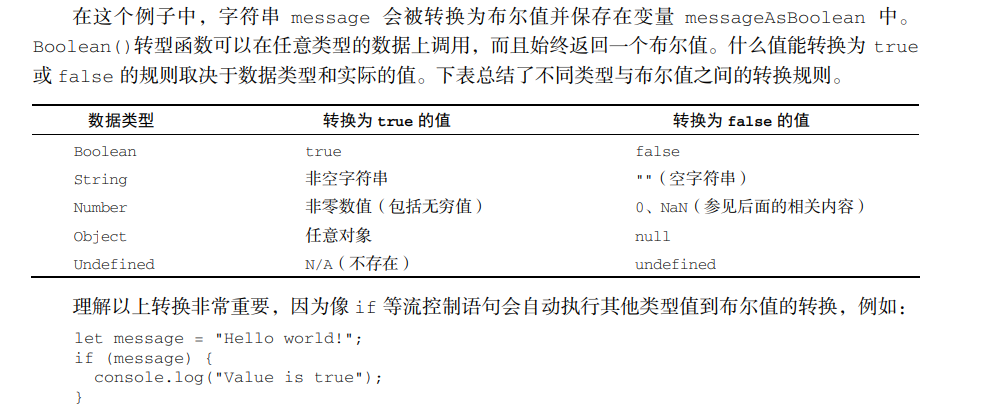
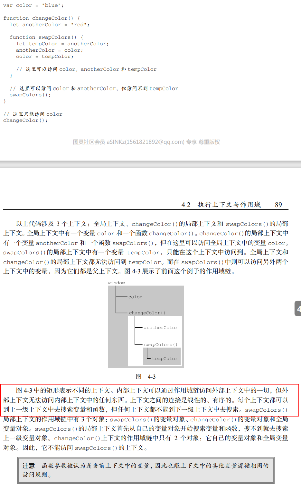

- 把JavaScript这本书，这本书总共28章，一周7章，一周的最后一天把之前学习的内容再复习下，这个计划还是有点偏理想，尽量按照这个计划进行

- **第1章**
- 完整的JavaScript包含的部分
    - 核心（ECMAScript） 欧洲计算机管理协会Script
    - 文档对象模型 DOM   提供与网页内容交互的方法和接口
    - 浏览器对象模型 BOM  提供与浏览器交互的方法和接口
    
- **第2章**
- \<script\>标签有哪些属性
    - 属性名  是否必须  干什么用的？
    - async 
    - charset 
    - crossorigin  
    - defer 
    - integrity 
    
- script 最大的一个争议点就是 它可以包含外部域的JavaScript文件，即使这个文件和html不再相同的域中  也就是引入文件的时候，不会出现跨域的问题
- 标签的位置
    - 把script标签放到head中间，页面加载的时候 需要先把script标签中的内容下载，解析和解释完成后，才开始渲染页面 所以一般放到body结束标签的上面
- 推迟脚本执行
    - 给引入的脚本文件添加属性 defer属性 告诉浏览器立即下载 但是延迟执行
- 异步执行脚本
    - 给引入的外部脚本文件添加 async属性 告诉浏览器立即下载，但是延迟执行，添加多个属性 脚本之间么有依赖关系的 有可能第二个脚本先执行
- 动态加载脚本(这个之前看过)
    ```javascript 1.8
          let script = document.createElement('script')
          script.scr = 'common.js'
          document.head.appendChild(script)
          // 不是所有的浏览器都支持async属性 统一加载行为  进行下面的设置
          script.async = false
          // 使用这种方式 对浏览器的预加载器是不可见的 也就是它不知道你加载了这个文件 需要在文档头部显式声明
          // <link rel="preload" href="common.js"></link> 
    ```
 - 行内代码和外部文件  基本上都选择外部文件的方式
    - 可维护性
    - 缓存  相同文件的话
    - 适应未来 
- 文档模式  混杂模式和标准模式  可以通过doctype 来进行切换

- 定义变量的方式let var const  
    ```javascript 1.8
        //  使用var可以这样使用
        hello = 'world'
        var hello;
        // 你这个变量定义在函数里面  外面就会报错的  如果不添加var 就不会报错
        function test(){var message = 'hello world';}  console.log(message)
    ```
    - let var
        - var 声明提升 就是把所有变量声明都拉到函数作用域的顶部 后面的代码正常执行 undefined `function test(){console.log(age);var age = 26}`
        - 暂时性死区  let 声明的变量不会再作用域中被提升 大概的意思就是 使用let定义变量  不能再没有定义之前使用
        - 全局变量  使用 var message = 'hello world' window.message 也会找到这个值  let就不会出现
        - let是快级作用域
        - for循环  
        ```javascript
              for(var i = 0; i < 5 ; i++) {
                console.log('hello world')
              }
              // 这里打印的i就是5  变量渗透到变量体之外了  使用let的话 迭代的变量会限制在for循环内部
              console.log(i)
              // 下面的例子是非常经典的面试题  最后打印的结果是多少  如果换成let声明会怎么样？  
              for(var j = 0; j < 5 ; i++) {
                setTimeout(() => console.log(j))
              }
        ```
    - const  和let使用规则是一样的  重点是const在声明变量的时候 一定要进行初始化 且尝试修改const定义的变量会报错

- 数据类型(Undefined Null Boolean Number String Symbol Object)
    - 怎么判断类型 `typeof 123;typeof '123'` typeof的结果有哪些(undefined,boolean,string,number,object,function,symbol)
    
    - Undefined类型 就一个值undefined 声明变量但是没有赋值 
    - Null类型  也就一个值null 表示一个空对象指针  typeof null  ==> object  
        - 在定义*对象*的时候 使用let obj = null;这样的方式定义 一般let obj;这样obj默认等于的哦就是undefined
        - null == undefined  ==> true 
    - Boolean类型
        - 说过JavaScript是区分大小写的 所以 true/false 和True/False是不一样的
        -  
        - 根据上面的语法，才可以写 `if(message){console.log(true)}` 这样的语法
    - Number类型
        - 永远不要测试某个特定的浮点值  `if(0.1+0.2 == 0.3){console.log(false)}` 
        - 最大值 Number.MAX_VALUE  最小值 Number.MIN_VALUE 如果一个数不在这个范围之内的话 用-Infinity/Infinity来表示负无穷大/正无穷大
            这样的值不能再进行运算 判断是否是无穷大的方式 isFinite()    
        - NaN  not a number  表示本来要返回数值的操作失败了 `0/0;-0/+0`   任何涉及NaN的操作始终返回NaN, NaN不等于包括NaN在内的任何值
            NaN == NaN ==> false  如果要判断的话 isNaN() 这种方式
        - 数字的转换 true -> 1;false -> 0;'' -> 0;'hello' -> 0;'00011' -> 11
        - parseInt('123abc') => 123 这个结果我是没想到的如果第一个字符不是数值字符、加号或减号，parseInt()立即
            返回 NaN。这意味着空字符串也会返回 NaN（这一点跟 Number()不一样，它返回 0）。如果第一个字符
           是数值字符、加号或减号，则继续依次检测每个字符，直到字符串末尾，或碰到非数值字符。  它还可以接受第二个参数 表示进行几进制转换 parseFloat一样效果
           
        - 字符串  一旦创建，他们的值不能发生变化了 要求改某个变量中的字符串，必须销毁员原来的哦字符串       
            


- 第4章节 变量 作用域  内存

- 变量：原始值和引用值
    1.动态属性   引用值可以添加属性  原始值可以添加属性 但是不报错
    2.复制值  引用值 它们指向同一个内存空间   原始值就是复制一份
    3.js中所有函数的参数传递都是值传递 函数外的值会被复制到函数内部的参数中  如果是对象的话  因为复制  
        所以改变的内部的对象也会反映到外边的参数上
    4. typeof 判断一个变量是否为原始类型  如果是引用值的话 更关心的是 它属于哪个对象 instanceof
- 执行上下文
    - 每个上下文都有一个关联的变量对象，上下文中定义的所有变量和函数都存在于这个对象上 全局上下文就是最外层的上下文 
        在浏览器中，就是window对象；我们使用var定义的全局变量，都会成为window对象的属性和方法。
    - 上下文在其所有代码都执行完毕后会被销毁 包括定义在它上面的所有变量和函数
    - 每个函数都有自己的上下文，当代码执行流进入函数时，函数的上线文被推到一个上下文栈上，当函数执行完毕后，上下文栈会弹出该函数的上下文
        将控制权返回之前的执行上下文。  js的执行流就是这样的
    - 上下文中的代码在执行的时候，会创建变量对象的一个 作用域链   它决定了各级上下文中的代码在访问变量和函数时的顺序 代码正在执行的上下文
        的变量对象适中位于作用域链的最前端 下一个变量来自下一个上下文 依次类推 全局上下文的变量对象 始终是作用域链的最后一个变量对象
    - 代码执行时的标识符解析是通过沿作用域链逐级别搜索标识符名称完成的 这个标识符就是变量名称
    ---
    
    - 访问的变量是按照作用域链条进行访问的， 上层的对象不能访问下层的对象 下层可以访问上层的
    - 作用域链增强  在使用某些语法的时候，会在作用域链前端添加一个变量对象
    ```javascript
      function buildUrl() { 
       let qs = "?debug=true"; 
          // with 里面属性用with定义的对象  这样定义会把location添加到作用域链前端  try catch的catch块也是一样的
           with(location){ 
              let url = href + qs; 
           } 
       return url; 
      } 
    
    ```
- 变量声明
    - 使用var的函数作用域 使用var声明的时候 变量会被添加到最接近的上下文中，在函数中，就是函数的局部上下文
    ```javascript 1.6
      // 打印undefined
      function add(a,b){var sum = a + b;return sum;}  console.log(sum)
      // 打印a+b的结果  因为sum没有进行定义 它被添加到全局上下文中  1 使用变量前一定要定义 2 尽量不要使用var定义
      function add1(a,b){ sum = a + b;return sum;}
      // 使用var声明 会被拿到函数或者全局作用域的顶部  位于作用域中所有代码之前 这种现象叫做提升 就像下面的
      // 提升的一个关键就是 变量输出undefined 不是Reference Error
      name = 'hell world'
      var name;
    ```
     - 使用let的块级作用域声明  没有变量提升  作用域只在自己定义的范围内
     - 使用const的常量声明  定义的时候必须进行初始化 定义好以后 不能改变定义的值(不想对象的属性也改变，Object.freeze())
     - 标识符查找 这里说的标识符就是变量名称  搜索开始于作用域的前端 在局部上下文中找到了，就不再进行查找(包括原型链上)
 - 垃圾回收
    - 基本思路就是 确认哪个变量不会再使用，然后释放它占用的内存。那么如果标记哪个变量不再使用呢？两种策略方案 垃圾回收会每隔一段时间运行
        1. 标记清理
            - 最常用的垃圾回收策略
            - 给使用的变量添加上一个标记(重点是添加标记，添加标记的方式有很多种) 例：可以维护一个  在上下文中 不在上下文中 两个变量列表
                可以把变量从一个列表中移动到另一个列表中   **标记的过程不重要，重要的是策略** 垃圾回收程序，会标记内存中所有的变量，
                把所有用到的变量的标记去掉 剩下的就是待删除的 随后垃圾回收程序做一次内存清理 销毁值并回收内存
        2. 引用计数
            - 所有的用到的变量，把他们的计数+1，等到他们的引用次数为0的时候 就和上面的操作一样 问题 像下面的引用 引用值永远不可能是0
             `let obj = new Object();let obj2 = new Object(); obj.test = obj2;obj2.test=obj`
    - 性能：什么时候调用垃圾回收程序？尤其是在移动端，不能频繁的进行调用，现代的垃圾回收机制程序会基于对JavaScript运行时的环境的探测
        来决定何时运行，探测机制因引擎而异 基本上都是根据已分配对象的大小和数量来判断的
    - 内存管理
         - 因为js运行的环境比较特殊，防止出现运行大量JavaScript的网页耗尽系统内存而导致操作系统崩溃 更多的是处于安全考虑
         - 定义对象的时候用null 对于不再用到的值把它赋值为null 在项目中 执行销毁的时候  把echarts图形销毁了
         - 使用let和const
         - 内存泄漏 问题的关键还是定义的变量在不使用的时候，不能进行销毁 使用var声明变量(定义到全局对象了) 定义器打印值
         - 提高性能，剩下的就是压榨浏览器了，如何减少浏览器执行垃圾回收的次数(决定何时运行的一个标准就是，对象更替的速度)
             ```javascript
                  //  像下面的函数 如果频繁的调用 不停的创建对象 依照上面的哦标准 也会频繁的调用垃圾回收程序 
                  function addVector(a, b) { 
                   let resultant = new Vector(); 
                   resultant.x = a.x + b.x; 
                   resultant.y = a.y + b.y; 
                   return resultant; 
                  }
                  // 这样对象没有更替  也就是不要动态的创建对象  可以采用线程池  就是jdbc线程池类似
                   function addVector2(a, b,resultant) { 
                      resultant.x = a.x + b.x; 
                      resultant.y = a.y + b.y; 
                      return resultant; 
                   } 
             ```
- 基本引用类型
 - 引用值是某个特定引用类型的实例，引用类型就是把数据和功能组织到一起的结构  **它不是类**  对象被认为是某个特定引用类型的实例
    通过new操作符，后面跟一个构造函数 
 - Date
    - let date = new Date() 它有一个方法 Date.parse() 尝试把穿进去的字符串转成该日期的毫秒数 在调用new Date('yyyy-MM-dd')
        的时候  默认会调用Date.parse()
 - RegExp 
    - let regexp = /cat/;  let regexp2 = new RegExp('cat','i');
    - 某些情况下，需要二次转义，\n  转义后是\\ 在正则表达式中 \\\\
    - RegExp实例主要的方法是exec('字符串')  
        - 如果正则表达式中没有设置 g 每次执行的结果都是一样的  设置g之后  每次执行exec的结果是不一样的
        - 如果模式设置了粘附标记 y，则每次调用 exec()就只会在 lastIndex 的位置上寻找匹配项。粘附标记覆盖全局标记
        - 需要知道 匹配的结果 如果没有匹配上返回null  如果匹配上了有两个属性 index(字符串中匹配模式的起始位置) input(需要查找的字符串)
    - 另一种使用方式就是 test('字符串') 成功匹配true
- 原始值包装类型(Boolean,Number,String类型)
    ```javascript
         let s1 = "hello world";
         let s2 = s1.substring(2);
         // 按理说s1是一个原始值  为什么第二行可以正常执行呢？ 因为系统默认执行了下面的动作
         let s1_ = new String("hello world");
         let s2_ = s1_.substring(2);
         let s1_ = null;
         // 引用类型和原始值包装类型的主要区别在于对象的生命周期  通过new创建的对象 会在离开作用域时被销毁 而自动创建的原始值包装对象则
         //   则值存在于访问它的那行代码执行期间
         // 下面第二行代码运行的时候会临时创建一个String对象 而在访问第三行的时候 这个对象已经被销毁了
         let q = "hello world"
         q.age = 12;
         console.log(q.age)
         // Boolean Number 都重写了 valueof  tolocalstring  tostring
         let test1 = "hello".concat(" world") // 拼接字符串
         // slice  substring  substr  都是传递1个或者2个参数 1个参数的时候就是从某个位置开始截取  两个参数的时候表达的意思不一致
          let stringValue2stringValue = "hello world"; 
          console.log(stringValue.slice(3, 7)); // "lo w" 
          console.log(stringValue.substring(3,7)); // "lo w" 
          console.log(stringValue.substr(3, 7)); // "lo worl"   第二个参数表示截取字符串的长度
          // 如果是负数的话  slice 第一个负参数转成 长度+该值 第二个直接转成0 substring 遇到负数 直接0
          let stringValue2 = "hello world"; 
          console.log(stringValue2.slice(-3)); // "rld"  装成长度 + -3
          console.log(stringValue2.substring(-3)); // "hello world"  负数直接0
          console.log(stringValue2.substr(-3)); // "rld"  装成长度 + -3
          console.log(stringValue2.slice(3, -4)); // "lo w"  第二个负数  装成长度 + -3
          console.log(stringValue2.substring(3, -4)); // "hel"  负数 0 substring(3,0) => substring(0,3) 
          console.log(stringValue2.substr(3, -4)); // "" (empty string)  substr(3,0) 字符串长度0 
          // indexOf()  lastIndexOf()  startsWith() endsWith() includes()  都可以传入第二个参数 表示开始执行函数的位置
          // padStart()  padEnd()  补齐字符串操作
          //  代码的功能与下一行等价：
          eval("console.log('hi')"); 
          console.log("hi"); 
    ```
              
- 集合引用类型
    - Object 创建对象的两种方式 new  字面量{}(如果定义的是数字属性，自动转成字符串)
    - Array  new Array(20)   字面量[]
        - from 将类数组结构转换为数组实例 任何可迭代的结构，或者有一个length属性和可索引元素的结构
        ```javascript
              console.log(Array.from('hello')); // [h,e,l,l,o] 有单引号的
              console.log(Array.from('set,或者map结构'));
              console.log(Array.from('array1数字的浅拷贝'));
              console.log(Array.from('数组',x => x*2)); // 第二个参数表示针对之前的操作 追加执行什么操作 不用map了
              // 第三个参数 指定映射函数中this的值  注意不要使用箭头函数
              const a1 = [1, 2, 3, 4]; 
              const a3 = Array.from(a1, function(x) {return x**this.exponent}, {exponent: 2});
        ```
        - of 把一组参数转成数组
        ```javascript
          console.log(Array.of(1, 2, 3, 4)); // [1, 2, 3, 4] 
          console.log(Array.of(undefined)); // [undefined]
       ``` 
        - 数组空位 `const a = Array.from([,,,])  // [undefined,undefined,undefined]`
        - 数组索引  数组的length的作用 假设 array.length等于2  手动执行 array.length = 5  其他的位置用undefined进行填充
                                array.length = 1  删除索引0之后的元素 
        - 检测数组  Array.isArray() 检测是否是数组
        - 迭代器方法
          ```javascript
          const a = ["foo", "bar", "baz", "qux"];
          // keys values() entries()
          const aKeys = Array.from(a.keys()); 
          const aValues = Array.from(a.values()); 
          const aEntries = Array.from(a.entries()); 
          console.log(aKeys); // [0, 1, 2, 3] 
          console.log(aValues); // ["foo", "bar", "baz", "qux"] 
          console.log(aEntries); // [[0, "foo"], [1, "bar"], [2, "baz"], [3, "qux"]]
          for (const [index,element] of a.entries()){console.log(index);console.log(element)}
          ```
        - 数组填充
        ```javascript
           // fill 向一个已有的数组中插入全部或者部分相同的值
           let array = new Array(10);
           array.fill(5); // [5,5,5,5,5,5,5...]
           array.fill(5,1,2); // 后两个参数  起始位置和结束位置
           // copWithin() 按照指定范围浅复制数组中部分内容  注意它会改变原数组
           let ints = [0, 1, 2, 3, 4, 5, 6, 7, 8, 9]; 
           ints.copyWithin(5); 
           console.log(ints); // [0, 1, 2, 3, 4, 0, 1, 2, 3, 4]
           let ints2 = [0, 1, 2, 3, 4, 5, 6, 7, 8, 9]; 
           ints2.copyWithin(4, 0, 3); 
           alert(ints);  // [0, 1, 2, 3, 0, 1, 2, 7, 8, 9]
        ```
        - 栈方法
        ```javascript
           // 栈是一种后进先出的结构  push('1','2') 
           let a = [1,2,3]
           let pop = a.pop(); // 弹出后 返回的是弹出的值 
       ```
        - 队列方法  先进先出 shift()  删除数组左边的元素   unshift() 向数组左侧插入元素
        - 排序方法  reserve() 数组反转  sort() 默认会给每一项调用String() 转型函数 所以针对number类型使用默认排序是不对的 传入一个
            比较函数  如果第一个元素应该排在第二个元素前面 应该返回负数 注意他们返回的都是数组的引用 也就是改变了元数组
        - 操作方法
        ```javascript
           let x = [1,2,3];
           let y = x.concat('x','3',[1,2]);  // [1,2,3,x,3,1,2]  数组扁平化了  可以配置一个参数 取消打平操作
           let colors = ["red", "green", "blue"]; 
           let newColors = ["black", "brown"]; 
           let moreNewColors = { 
            [Symbol.isConcatSpreadable]: true, 
            length: 2, 
            0: "pink", 
            1: "cyan" 
           }; 
           newColors[Symbol.isConcatSpreadable] = false; 
           // 强制不打平数组
           let colors2 = colors.concat("yellow", newColors); 
           // 强制打平类数组对象
           let colors3 = colors.concat(moreNewColors); 
           console.log(colors); // ["red", "green", "blue"] 
           console.log(colors2); // ["red", "green", "blue", "yellow", ["black", "brown"]] 
           console.log(colors3); // ["red", "green", "blue", "pink", "cyan"]
           
           // slice() 截取原来的数组
           // splice()
           // 删除  传递两个参数  第一个参数 需要删除第一个元素的位置 第二个参数删除的个数
           // 新增  传递3个参数   开始的位置 0(需要删除0个元素)  后面就是需要插入的元素个数
           // 替换  传递3个参数   开始的位置，需要删除元素的个数  后面就是需要插入的元素 可以是多个  先删除 然后再插入
        ```
        - 搜索和位置方法 在使用indexOf lastIndexOf 和参数比较的时候 使用的是严格相等 ===  还有就是find() findIndex() 
        - 迭代方法  这些都不改变原数组
            - every() 判断每一项是否都满足特定的条件 有一个false 直接返回false
            - filter()  过滤出满足条件的元素
            - some()  判断其中是否有满足条件的元素  有一个true 直接true
            - map() 改变元素
            - forEach() 循环遍历元素 
        - 归并数组 reduce() reduceRight()  两个参数 函数 和 归并的起始位置 `let values = [1, 2, 3, 4, 5];
        let sum = values.reduce((prev, cur, index, array) => prev + cur);`   
    - Map
        - js中的map会维护键值对的插入顺序 这个和java是不一样的 剩下的方法就和java是一样的 put get has size   
        - map中对象也可以做键 
    - Set
        - new Set([1,3,4])  set.add()
        - set也会维护插入时的顺序

- 迭代器和生成器
    - 迭代会在一个有序的集合上进行(集合中所有项都可以按照既定的顺序被遍历到)  这个之前真没有注意到
    - 一般在迭代的时候使用的是fori 问题是迭代之前需要知道如何使用数据结构(数组啊，map啊，set啊)  es5新增的是foreach 
        这个的问题是没有办法 标识何时终止
    - 迭代器模式：实现正式的Iterable接口 而且可以通过迭代器Iterator消费
    - 可迭代协议：必须暴露一个属性作为默认迭代器 并且这个属性值必须是 Symbol.iterator作为键  
        这个默认迭代器属性必须引用一个迭代器工厂 调用这个工厂函数必须返回一个新迭代器     
    - 迭代器协议
      ```javascript
          // 迭代器是一种一次性使用的对象 用于迭代预期关联的可迭代对象  使用next()方法 在可迭代对象中访问数据
          // 返回的是 IteratorResult对象 两个属性 done value 
          // 可迭代对象
          let arr = ['foo', 'bar'];
          let iter = arr[Symbol.iterator](); 
          console.log(iter); // ArrayIterator {}
          // 执行迭代
          console.log(iter.next()); // { done: false, value: 'foo' } 
          console.log(iter.next()); // { done: false, value: 'bar' } 
          console.log(iter.next()); // { done: true, value: undefined }  
      ```
    - 自定义迭代器
      ```javascript
          class Counter{
              constructor(limit){
                  this.count = 1;
                  this.limit = limit;
              }
              next(){
                  if(this.count <= this.limit){return {done:false,value:this.count++}}
                  else{return {done:true,value: undefined}}
              }
              [Symbol.iterator](){return this}
          }
          let counter = new Counter(3);
          for(let i of counter){console.log(i)}  // 默认会调用next() 方法  问题就是这里的count会在迭代一次后就就是3了
          class CounterNew{
            constructor(limit){
                this.count = 1;
                this.limit = limit;
            }
            [Symbol.iterator](){
                  let count = 1,limit = this.limit;
                  return {
                      next(){
                          if(this.count <= this.limit){return {done:false,value:this.count++}}
                          else{return {done:true,value: undefined}}
                        }          
                  } 
            }
              
          }
          // 提前终止迭代器 return() 方法用于指定迭代器提前关闭时执行的逻辑 for-of 可以通过 break continue return throw
          //    提前退出  return() 方法必须返回一个有效的IteratorResult对象 {done:true}
          class Counter2 { 
           constructor(limit) { 
              this.limit = limit; 
           } 
           [Symbol.iterator]() { 
               let count = 1, 
               limit = this.limit; 
               return { 
                   next() { 
                   if (count <= limit) { 
                      return { done: false, value: count++ }; 
                       } else { 
                          return { done: true }; 
                       } 
                   }, 
                   return() { 
                       console.log('Exiting early'); 
                          return { done: true }; 
                       } 
                   }; 
               } 
          }
          // 如果迭代器对象没有关闭的话 还可以继续上次离开的地方继续进行迭代
           let a = [1, 2, 3, 4, 5]; 
           let iter = a[Symbol.iterator](); 
           for (let i of iter) { 
            console.log(i); 
            if (i > 2) { 
            break 
            } 
           } 
           // 1 
           // 2 
           // 3 
           for (let i of iter) { 
            console.log(i); 
           } 
           // 4 
           // 5 
      ```
    - 生成器
      ```javascript
         // 生成器的形式是一个函数  函数名称前面添加一个 *  表示他是生成器 
         function * demo(){}
         let demo2 = function *(){}
         let foo = {* demo3(){}}
         class foo2{* demo4(){}}
         // 调用生成器函数会产生一个生成器对象 一开始它处于暂停状态，它也实现是了iterator接口 也有next() 方法 
         // 调用这个方法会让生成器开始或者恢复执行 它的返回值和类似于迭代器 一个done 一个value属性
         // 通过yield中断执行  它可以让生成器停止和开始执行
         function * demo5(){yield ;}
         let demo5Obj = demo5();
         console.log(demo5Obj.next()); // {done:false,value:undefined}
         console.log(demo5Obj.next()); // {done:true,value:undefined}
         // yield生成的值 会出现在next() 方法返回的对象里面
         function* generatorFn() { 
              yield 'foo'; 
              yield 'bar'; 
              return 'baz'; 
         } 
         let generatorObject = generatorFn(); 
         console.log(generatorObject.next()); // { done: false, value: 'foo' } 
         console.log(generatorObject.next()); // { done: false, value: 'bar' } 
         console.log(generatorObject.next()); // { done: true, value: 'baz' } 
         // yield必须直接位于生成器函数定义中 出现在嵌套的非生成器函数中会有语法错误
         // yield 会接收到传给next()方法的第一个值
         function* generatorFn2(initial) { 
          console.log(initial); 
          console.log(yield); 
          console.log(yield); 
         } 
         let generatorObject2 = generatorFn2('foo');
         // 书上说 第一个调用next()传入的值不会被使用 因为第一个调用是为了开始 执行生成器函数
         generatorObject2.next('bar'); // foo   
         generatorObject2.next('baz'); // baz  
         generatorObject2.next('qux'); // qux 
         // yield *  让它能够迭代一个可迭代的对象 从而一次产出一个值
         function* generatorFn4() { 
          yield* [1, 2]; 
          yield *[3, 4]; 
          yield * [5, 6]; 
         } 
         for (const x of generatorFn4()) { 
          console.log(x); 
         } 
         // 1 
         // 2 
         // 3 
         // 4 
         // 5 
         // 6 
         
         // 生成器作为默认迭代器
         class Foo { 
              constructor() { 
                  this.values = [1, 2, 3]; 
              }
              * [Symbol.iterator]() { 
                   yield* this.values; 
               }
          }
         // return 和 throw 会强制让生成器进入关闭状态
         function* generatorFn5() { 
          for (const x of [1, 2, 3]) { 
          yield x; 
          } 
         } 
         const g = generatorFn5(); 
         console.log(g); // generatorFn {<suspended>} 
         console.log(g.return(4)); // { done: true, value: 4 } 
         console.log(g); // generatorFn {<closed>}
         // 需要注意的是 使用for-of 会自动忽略done为true的值
      
         // throw方法会暂定的时候将一个提供的错误注入到生成器对象中，如果错误没有被处理 生成器就会被关闭
         function* generatorFn6() { 
          for (const x of [1, 2, 3]) { 
          yield x; 
          } 
         } 
         const g = generatorFn6(); 
         console.log(g); // generatorFn {<suspended>} 
         try { 
          g.throw('foo'); 
         } catch (e) { 
          console.log(e); // foo 
         } 
         console.log(g); // generatorFn {<closed>}  
         // 如果生成器内部处理了这个异常 则生成器就不会关闭  错误处理会跳过对应的yield
         function* generatorFn7() { 
          for (const x of [1, 2, 3]) { 
              try { 
                   yield x; 
              } catch(e) {} 
          } 
         } 
         const g = generatorFn(); 
         console.log(g.next()); // { done: false, value: 1} 
         g.throw('foo'); 
         console.log(g.next()); // { done: false, value: 3}
      
      ```
